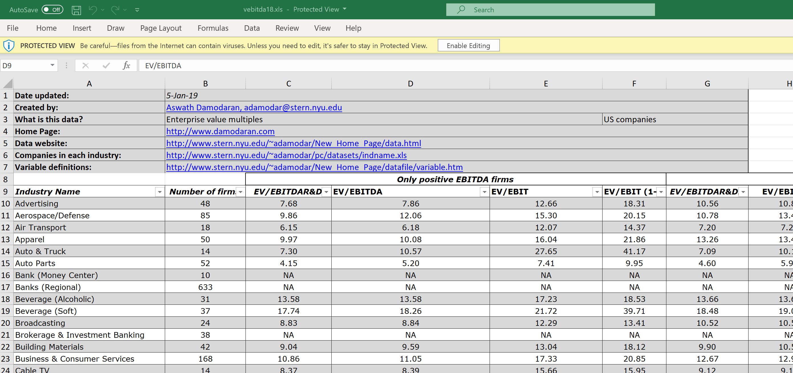

NYU professor Aswath Damodaran has very helpful data about many important financial market indicators such as discount rates, valuation multiples, etc. on his [website](http://pages.stern.nyu.edu/~adamodar/New_Home_Page/dataarchived.html). He also provides an archive with the history of these indicators. However, the data is saved in separate Excel files that do not necessarily have a standardized format to easily obtain the information automatically. As I am not a big friend of manually downloading dozens of files and copying the information together, this post shows you how to do it automatically in [R](https://www.r-project.org/).

Let's start with the problem: The screenshot below gives an example of one of Damodaran's files. As you can see, there are a couple of rows at the beginning that contain metadata, while the actual data set starts in row 10. Unfortunately, this format can change from file to file, so you cannot be sure that every file is having the exact same format.



```{r setup, include=FALSE}
knitr::opts_chunk$set(echo = FALSE)
```

By looking at a few of these files though, I noticed that the general format is always the same and can be split in two parts:

1. At the beginning, there might be some rows that provide additional information about the file
2. After that, the actual data set begins

So all we have to do is to write a function that reads in the Excel file and tries to determine which rows belong to part 1 and which belong to part 2. The below function does exactly that. It requires the `readxl` package to read in the Excel file, the `httr` package to get the correct URL to the Excel file, and the `data.table` package because I forgot by now how to work with R's standard `data.frame`s. 

```{r Import_Excel_function}
#' Wrapper to import data from Excel
#'
#' This functions serves as a wrapper to easily import data from particular Excel files, for example
#' as provided by Damodaran on his website. These Excel files have a format in which information is
#' provided in the first couple of lines and then the actual data set starts.
#'
#' Functions such as \code{\link{read_excel}} allow the user to explicitly tell the function which
#' rows to skip. While this is certainly a helpful feature, it becomes cumbersome for many similar
#' files but with different number of rows that can be skipped as the user would have to open each
#' file manually to come up with the parameters. This wrapper tries to do it automatically.
#'
#'
#' @param .str_file string; file location.
#' @param .file_ext string; extension of the Excel-file. Default: ".xls", for which this function
#'                  is tested. So might not work with other Excel file extensions.
#' @param .perc_numeric numeric; the percentage above which you assume a column is of type numeric.
#'                      Background: in the function, you convert a column to numeric with \code{
#'                      as.numeric}; this will return NA if this function does not know how to
#'                      convert the value to numeric; hence, you can guess now that if there aren't
#'                      too many NAs from this function, the column is actually a numeric one.
#'                      The default is 0.15, which means that a column is considered numeric if
#'                      at least 15 per cent of the values can be converted.
#' @param .bol_option_1 boolean; if TRUE, the header position is determined by looking at the starting
#'                      point of non-NA values after conversion to non-numeric that occurs most often.
#'                      if FALSE, you use the first row that has all observations (which is most likely
#'                      the header).
#' @return data.table from reading the Excel file with the start row determined by this wrapper.
#'
#' @importFrom readxl read_excel
#' @importFrom httr GET write_disk
#'
#' @export
#'
#' @references
#' \url{https://stackoverflow.com/questions/41368628/read-excel-file-from-a-url-using-the-readxl-package}
#'
#' @examples
#' \dontrun{
#' str_file <- "http://pages.stern.nyu.edu/~adamodar/pc/archives/vebitda18.xls"
#' import_from_excel(str_file)
#' }
import_from_excel <- function(.str_file, .file_ext = ".xls", .perc_numeric=0.15,
                              .bol_option_1=TRUE, ...) {

  #### Save URL file locally with GET
  httr::GET(.str_file, write_disk(tf <- tempfile(fileext = ".xls")))

  ####Save the file into a data.table
  intDT <- as.data.table(readxl::read_excel(tf))

  ####Determine first row by two ways

  ## 1. It's likely that most columns in the data set are numeric; hence, you will convert
  #     each column to a numeric and save the first non-NA number; the row where this happens
  #     most often (essentially the median) is your best guess for the first data row (i.e.
  #     one below the header)
  i <- 1
  vec_first_number <- numeric(ncol(intDT))
  col_types <- rep("guess", times=ncol(intDT))
  for (col in names(intDT)) {

    vec <- suppressWarnings(as.numeric(unlist(intDT[,col, with=FALSE])))
    vec_first_number[i] <- suppressWarnings(min(which(!is.na(vec))))
    #In case there is no numeric data in there, your best  guess is that the data set starts
    #at the second line (after headers)
    if (!is.finite(vec_first_number[i])) {
      vec_first_number[i] <- 2
    }
    # Also save if you believe that the column in a numeric one, as you can read the column as
    # numeric later
    if (sum(!is.na(vec))/length(vec)>.perc_numeric) {
      col_types[i] <- "numeric"
    }
    i <- i + 1
  }
  pos_header1 <- median(vec_first_number, na.rm=TRUE) - 1

  ## 2. If the first few rows do not belong yet to the actual data set, you would expect more NAs
  #     there than in the data set thereafter. In particular in case of a data set with headers,
  #     with you kinda require here, you must expect that the row with the headers doesn't have
  #     any NAs; hence, simply use the first occurrence of a row with no NAs as the decision
  #     criterium
  #     Of course, this can fail if one of the information rows is filled up or if there is
  #     no header row or even the header includes NAs.

  # Get NAs per row
  # https://stackoverflow.com/questions/35306500/r-data-table-count-na-per-row
  intDT[, num_obs := Reduce(`+`, lapply(.SD,function(x) !is.na(x)))]
  pos_header2 <- suppressWarnings(min(which(intDT$num_obs==max(intDT$num_obs))))
  if (!is.finite(pos_header2)) {
    pos_header2 <- 1
  }
  intDT[, num_obs:=NULL]

  if (pos_header1==pos_header2) {
    cat("Success: Both approaches in import_from_excel guessed the same start row of the data set.\n")
    pos_header <- pos_header1
  } else {
    ifelse(.bol_option_1, pos_header <- pos_header1, pos_header <- pos_header2)
  }

  #Download data again, now with skip filled in and check then number of columns; trim col_types
  #This has to be done as otherwise it can happen that the last column doesn't exist anymore
  #because it was only read before due to a line that is now excluded.
  #See http://pages.stern.nyu.edu/~adamodar/pc/archives/fundgrEB14.xls as an example
  intDT <- as.data.table(readxl::read_excel(tf, skip=pos_header))
  if (ncol(intDT)<length(col_types)) {
    col_types <- col_types[1:ncol(intDT)]
  }

  intDT <- as.data.table(readxl::read_excel(tf,
                                    skip=pos_header,
                                    col_names = TRUE,
                                    col_types = col_types,
                                    ...))
  unlink(tf) #Clean up the temporary file
  return(intDT)

}
```

You can study the code in detail to figure out what's going on, but in short it reads in the data and takes advantage of the fact that if a row is not yet a row of the data set, it most likely has a lot of NAs because import functions such as `read_excel()` convert missing cells to NA. You should then find a structural difference between rows from part 1 - they have many NAs - and rows from part 2 (the actual data set), which should not have many NAs. Of course, this will not work in all situations. For example, if many cells are filled in the first part or if the data set in part 2 does not have many columns, it is hard for the function to differentiate correctly.

Anyways, let's try the function out! I show how the function works on two examples, the EV/EBITDA and EPS Growth rate files. All we have to do is look on Damodaran's website on how many years he is covering, entering the years in the for-loop, running `import_from_excel()` iteratively and putting the files together with `rbind`. 


```{r Obtain_data, echo=FALSE, message=FALSE, results='hide'}
#Load packages that are required for the function import_from_excel
library(data.table)
library(readxl)
library(httr)
### Download EV/EBITDA multiples
str_path <- "http://pages.stern.nyu.edu/~adamodar/pc/archives/" 
DT <- data.table()
for (year in 1998:2018) {
  
  intDT <- import_from_excel(.str_file=paste0(str_path, "vebitda", substr(year,star=3,stop=4), ".xls"),
                             na = c("NA", "N/A"))
  intDT[, Year:=year]
  DT <- rbind(DT, intDT, fill=TRUE)
                          
} 
### Download Growth Rates
growthDT <- data.table()
for (year in 1998:2018) {
  
  intDT <- import_from_excel(.str_file=paste0(str_path, "fundgrEB", substr(year,star=3,stop=4), ".xls"),
                             na = c("NA", "N/A"))
  intDT[, Year:=year]
  growthDT <- rbind(growthDT, intDT, fill=TRUE)
                          
} 
```


Within a minute or so, the data is downloaded, which saves quite a bit of time compared to downloading 20 or so files and combining them. Unfortunately, the job is not quite done yet, as a look at the table below shows. For example, the column names are now always the same so you have to check now which columns changed the name over time and adjust your data set accordingly. 

```{r Data_unadjusted, layout="l-body-outset"}
library(rmarkdown)
library(kableExtra)
library(dplyr)
DT %>% 
   mutate_if(is.numeric, format, digits=2, nsmall = 0, big.mark=",", scientific=FALSE) %>%
   paged_table()
```

Let's go through these steps for the EV/EBITDA data set:

- Combine columns such as "Industry Name" to "Industry"
- Damodaran does not use a consistent industry classification over time so I only focus on industries that are at least for 15 years in the data set; note that often Damodaran seems to use more specific industry classifications such as "Industry (Canada)" and you could just add them to the larger Industry; however, this is much more work intensive and might also not be so easy as you get aggregate numbers to start with.
- Check that always the same column names were used: This is not the case. For example, Damodaran started using subsamples such as only EBITDA positive firms; this makes it quite hard to figure out automatically which column refers to which calculation; it seems though that at the most he separates between all and EBITDA-positive firms, which he didn't do at the beginning.
- Rename column names to work easier with them in `R`


```{r Consistency_checks_data}
#It seems that he once labeled the Industry column "Industry Name", so let's rename it "Industry"
#DT[,list(NA1 = sum(is.na(`Industry Name`)), NA2 = sum(is.na(Industry))),by=Year]
DT[is.na(Industry), Industry:=`Industry Name`]
DT[, `Industry Name`:=NULL]
#Same for Number of f/Firms
DT[is.na(`Number of Firms`), `Number of Firms`:=`Number of firms`]
DT[, `Number of firms`:=NULL]
#Only use Industries that are persistently in the data set
DT[,N:=.N,by=Industry]
DT <- DT[N>=15]
DT[, N:=NULL]
#Merge Value/EBITDA and EV/EBITDA
DT[, EV_EBITDA:=`Value/EBITDA`]
DT[is.na(EV_EBITDA), EV_EBITDA:=`EV/EBITDA`]
#Rename columns
setnames(DT, 
         old = c("MV of Equity", "ST Debt", "LT Debt", "Effective Tax Rate"),
         new = c("Equity",       "stDebt",  "ltDebt",  "Tax_rate"))
DT[, Debt:=stDebt + ltDebt]
DT[, Debt_EBITDA := Debt/EBITDA]
DT[!is.finite(Debt_EBITDA), Debt_EBITDA:=NA]
```

Let's again look at the data set.


```{r Data_adjusted, layout="l-body-outset"}
DT %>% 
   mutate_if(is.numeric, format, digits=2, nsmall = 0, big.mark=",", scientific=FALSE) %>%
   paged_table()
```

Now we can already analyze the data, for example by looking at a box plot chart per industry.

```{r Boxplot, fig.asp=1.3}
library(ggplot2)
DT[EV_EBITDA < 30 & EV_EBITDA>0, MedianMult:= median(EV_EBITDA, na.rm=TRUE),by=Industry]
ggplot(data = DT[EV_EBITDA>0 & EV_EBITDA <30], 
       aes(x = reorder(Industry, MedianMult, na.rm=TRUE), y = EV_EBITDA)) + #fill = Continent_Name)) +
 geom_boxplot() + ylim(c(0,30))  + ylab("EV/EBITDA") + xlab("Industry") + coord_flip()

```