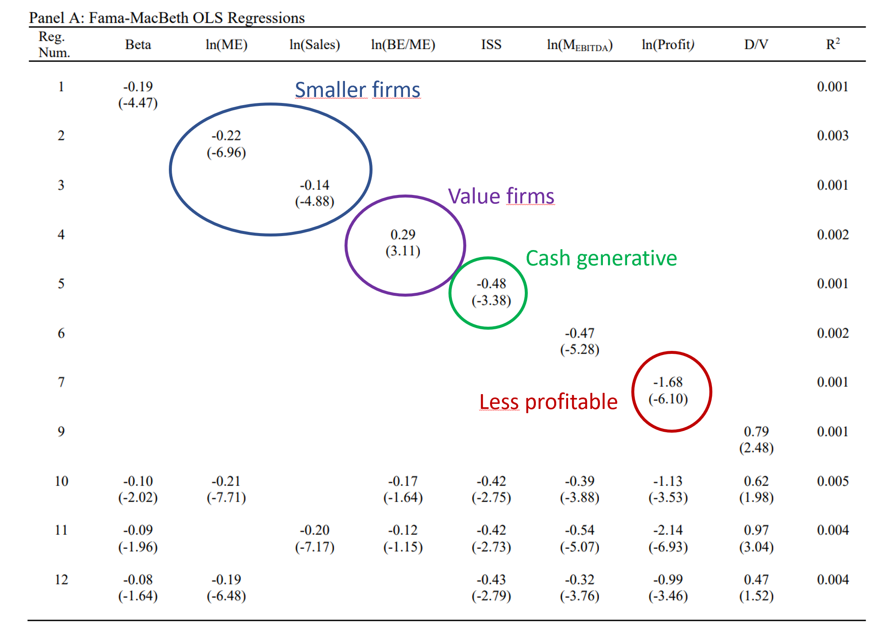
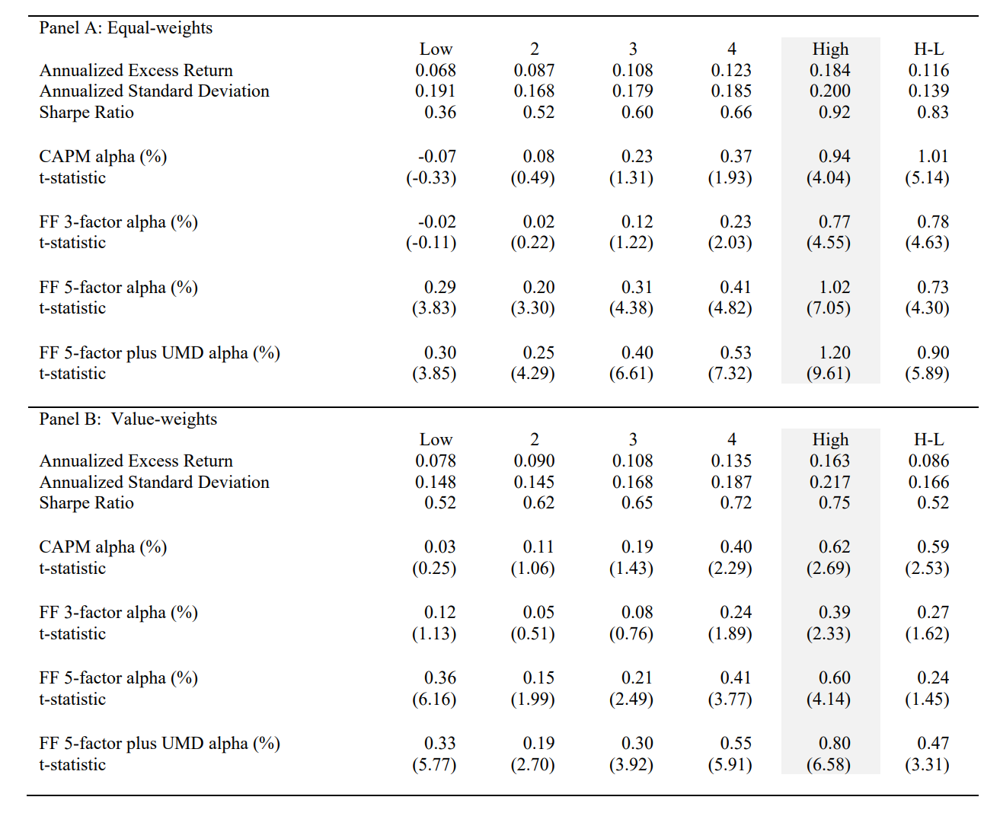
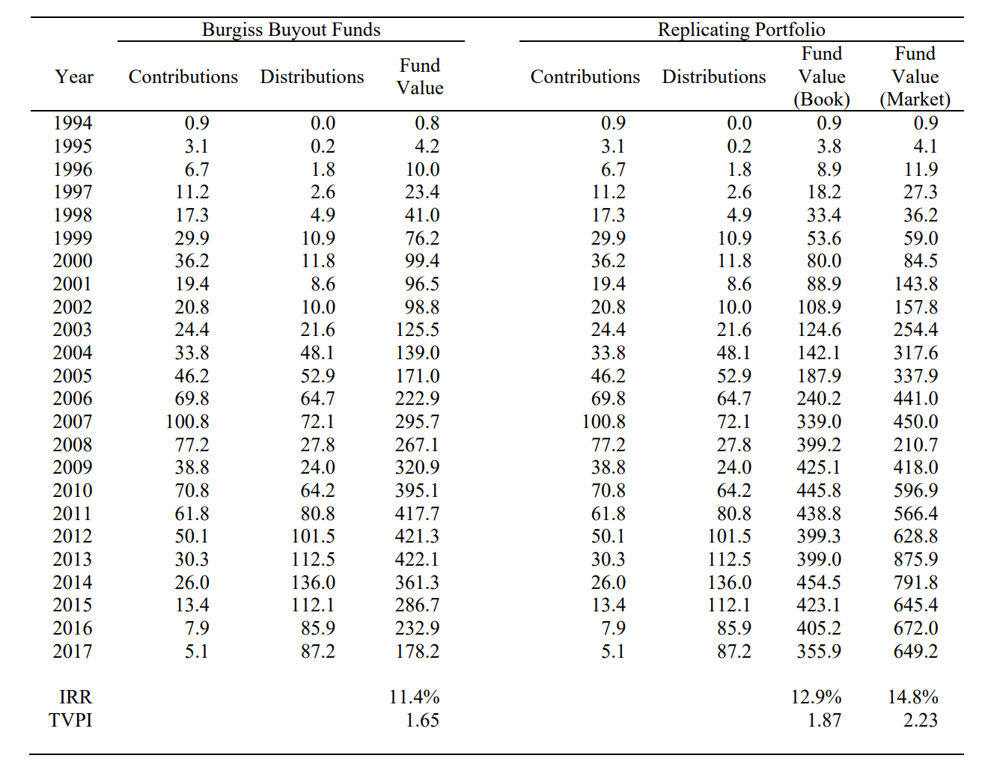
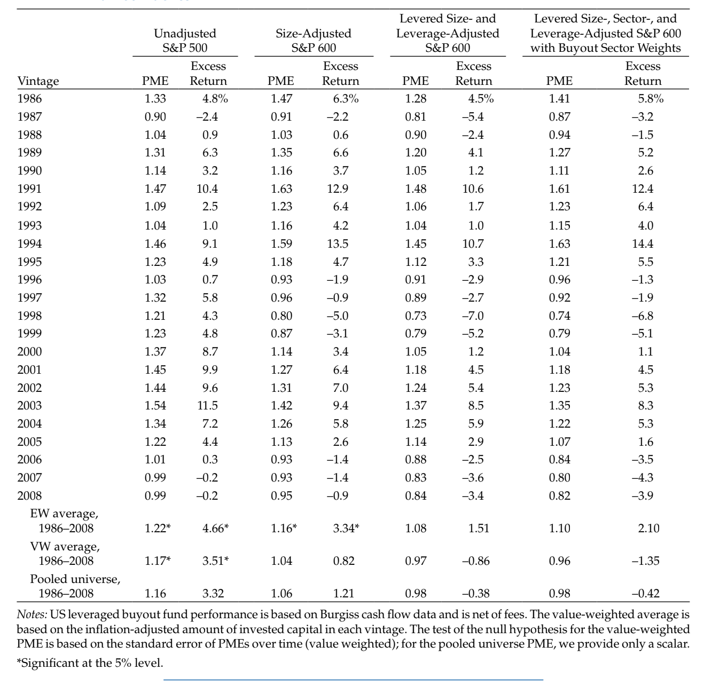

```{r setup, include=FALSE}
knitr::opts_chunk$set(echo = FALSE)
```

Over the last decades, buyout funds have consistently performed better than the broader public equity markets.^[[Harris et al. (2014)](https://onlinelibrary.wiley.com/doi/abs/10.1111/jofi.12154) is a recent study that documents the outperformance.] What factors explain this outperformance? A new [study](https://papers.ssrn.com/sol3/papers.cfm?abstract_id=2720479) by Erik Stafford finds that it's a combination of strong selection skills by PE managers and leverage.

Stafford starts with a data set of 667 public-to-private transactions from 1984 to 2017 collected from Thomson Reuters and CapitalIQ. He then identifies factors that increase the likelihood of a company to be taken private. The results are shown in his Table 4:



Not surprisingly, take-private transactions happen with *relatively* small public firms. Emphasis on relative: for private equity, these are still some of the biggest deals ever pulled off and only the largest PE firms can get them done; for public equity, those are the smaller companies though. Don't expect a take-private of Apple or Amazon anytime soon! Furthermore, companies taken private by PE firms tend to be value stocks, as they have a lower book-to-market ratio, and they tend to be cash generative. ISS is a three-year net equity issuance measure. As it is more negative for take-private transactions, it implies that these firms have repurchased their own shares, rather than issued new ones. Finally, take-private firms have lower profitability than the firms of the overall sample. 

Of course, small and value stocks are known to have generated persistently higher returns over decades, so much so that they became their own risk factors.^[I'm of course referring to the Fama-French 3-factor model, based on their landmark [1992 paper](https://onlinelibrary.wiley.com/doi/full/10.1111/j.1540-6261.1992.tb04398.x).] So the question is if the outperformance is simply a combination of a value and size effect. The short answer is no. 

To show that, Stafford classifies stocks into groups, either based on their EBITDA multiple (Table 5), or based on their likelihood to be PE-targets based on the characteristics he identified previously (Table 6).^[In case you wonder: he makes sure that he only uses information that is known at the time.]

Let's look at the results of Table 6:



In short, firms that a typically PE firm targets have outperformed other listed firms considerably. The difference in returns between the group with the highest likelihood of being a PE target and the lowest likelihood is 18.4% per year for the equal-weighted portfolio and 16.3% for the value-weighted portfolio. Even when adjusting for common risk-factors (CAPM, FF 3-and-5 factor), there continues to be a statistically significant alpha.

After Stafford has shown that PE managers did a great job selecting take-private targets and that he is able to run a replicating strategy to identify such targets, he creates a replicating portfolio by investing in the top quintile stocks of the predicted PE-targets (essentially, he tries to get into the Group *High* stocks in Table 6). On top of that, he leverages the positions 2x the target weight, with 25% of debt amortizing over 4 years and repayment of remaining debt at the time that the position is liquidated. This is done because private equity investments are substantially higher levered than publicly listed firms and he wants to ensure that he makes an apple-to-apple comparison. In addition, he considers management fees of 1% per year on the portfolio assets (i.e., 2% on equity levered 2x) and calculates the unrealized value not by using the stock price, but by calculating a book value with hold-to-maturity accounting.

In Table 8, he compares this replicating portfolio with a portfolio from the Burgiss data set, so actual private equity funds:



The table shows that the replicating portfolio can closely mimic the performance of private equity funds. He concludes (my emphasis):

> **The key result is that the asset selection identified from the public-to-private transactions has been excellent historically.** The selection analysis of public buyouts finds that characteristics beyond those used to construct common factors are important. Portfolios managed to match these characteristics earn positive risk-adjusted returns after controlling for common factors. **This suggests that PE buyout managers may be skilled at asset selection.** There is no direct evidence that their individual stock selection improves returns over their style-tilts, but these managers were early to value investing, using a selection strategy that performed better than other commonly available versions, and in the process, improved investor access to these difficult to invest in exposures. To the extent that PE fund managers are skilled at asset selection, they may optimally deviate from their historical rules in the future. **Looking back, an allocator is almost surely pleased to have allocated to PE buyouts.** 

It is important to keep in mind that Stafford is not able to look into other important factors of PE investments, such as differences in the ownership structure and, in turn, governance as well as operational changes initiated by the PE manager. However, as his replicating portfolio already performs slightly better than the Burgiss data, he argues that other factors should have a negative impact on the returns, most likely because they reduce risk.

I'm a bit surprised that Stafford doesn't cite the [study](https://www.researchgate.net/publication/303794464_A_Bottom-Up_Approach_to_the_Risk-Adjusted_Performance_of_the_Buyout_Fund_Market) by L'Her et al. from 2016, which in my opinion is comparable both by the approach and the results. The starting point of this study is also the outperformance of private equity compared to a broad stock market index such as the S&P 500, as measured with the public market equivalent ([PME](https://en.wikipedia.org/wiki/Public_Market_Equivalent)). The authors then look at 3,492 buyout transactions^[Not only take-privates, in contrast to Stafford's study.] that happened between 1993 and 2013 from CapitalIQ and obtained information about the leverage from LCD on over 1,400 of those transactions. Finally, they created alternative public market indices adjusted for the leverage, the size, and the sector composition of the buyout transactions. When comparing the performance of private equity funds, again measured with the Burgiss data set, with these adjusted indices, they show that the outperformance disappears. The PME is reduced from 1.22/1.17 (equal- and value-weighted) in case of the unadjusted S&P 500 to 1.10/0.96 in case of the fully adjusted stock market index:



To summarize, both studies show that private equity returns could have been partially replicated historically by focusing on smaller firms and using leverage. Both studies further imply that PE managers had great selection skills. In the case of the study of L'Her et al., this is shown by the fact that PE managers have chosen better performing sectors, in case of Stafford's study, by replicating the PE selection with a model that is based on several characteristics. 

It will be interesting to see if PE managers continue to select the same firms going forward or if they deviate from their historical rules in the future.