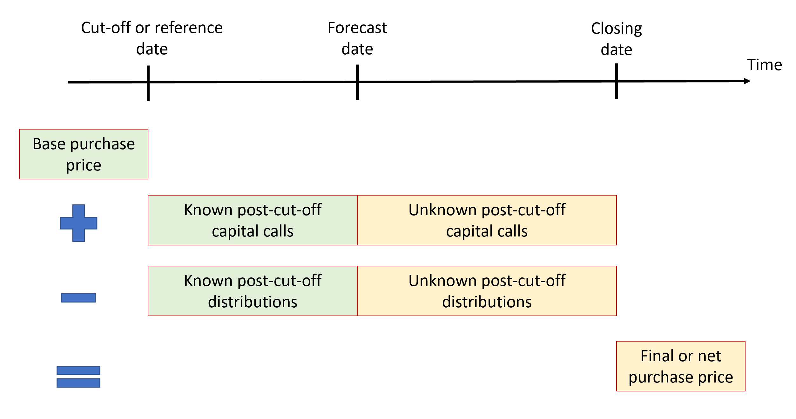

```{r setup, include=FALSE}
knitr::opts_chunk$set(echo = FALSE)
```

Private equity is an *illiquid* asset class for a reason: everything needs time. While you can read a negative article about a listed company in your portfolio in the newspaper and sell its stock the very same day, good luck trying that with a private equity fund you hold.

Over the last decades, a large [secondary market](https://en.wikipedia.org/wiki/Private_equity_secondary_market) for private equity assets has evolved. Despite its rapid growth, the closing process continues to take time, at least a couple of weeks and often a couple of months. In this post, I'm exploring the implications of the prolonged closing process on the purchase price calculations.

Let's start with a schematic representation of the closing process that shows the three important dates: the reference or cut-off date, the forecast date, and the closing date.



The **reference date** is the date at which it is assumed that the economic benefits and risks of owning the fund interest are transferred from the seller to the buyer. Put simply, until this date, the seller should pay for capital calls and receive distributions; after this date, the buyer should pay for capital calls and receive distributions. This date lies in the past and is a date at which the seller legally still owns the fund interest. Why use a date in the past? The reason is the reporting lag of private equity funds: the buyer must base his analysis on information provided by the underlying fund manager, which typically report quarterly and with a lag of 60 to 90 days. So when a seller wants to sell his fund interest, say, in May 2021, the most recent information he most likely has on the fund is the Q4 2020 reporting. The buyer then bases his analysis on the Q4 2020 and also offers a **base purchase price** as of this reference date.

The price the buyer is willing to pay is dependent on the cash flows he gets from holding the fund interest. As he does the analysis at the **forecast date**, but it is assumed that he held the interest already at the reference date, he considers the known capital calls and distributions from the reference to the forecast date. In the above picture, these are the distribution and capital call boxes marked in green.

If the seller accepts the buyer's price, a sales and purchase agreement is negotiated and signed and the fund interest is transferred from the seller to the buyer. With the transfer and the simultaneous payment of the purchase price, the transaction is closed; and the date the closing happens is called the **closing date**. It typically takes another few weeks from a principal agreement of the purchase price between the seller and the buyer to the closing. The underlying fund manager also has to approve the transfer and often requires the transfer to happen at a quarter-end date. Hence, in the above example, if the negotiations start in May 2021 as the seller waited for December 31, 2020 numbers, it might very well be that the transaction only closes on September 30, 2021, a nine months time gap between the reference date and the closing date.

<aside>
Compare this with buying a stock: the buyer bases his price on all the information available up until the day he purchases the stock, so the reference, forecast and closing date are all on the same date!
</aside>

To recap: the buyer offers to buy the fund interest as of the reference date, while he actually pays the seller at the closing date. So what happens with all the capital calls and distributions that happen in between, those known to the buyer when he did his underwriting (green boxes) and those additional ones before the closing (yellow boxes)? Well, in the first place, since the transfer has not happened yet, the seller continues to pay the capital calls and to receive the distributions. However, as it is assumed that the buyer is the owner of the fund interest as of the reference date these cash flows should have been the buyer's, so he should have paid for the capital calls and he should have received the distributions. There is a simple fix to this issue: at closing, the **final or net purchase price** can be calculated by adjusting for all these interim or **post-cut-off** cash flows: all capital calls increase the purchase price - as the seller has paid for them, but the buyer should have - and all distributions reduce the purchase price - as the seller has received them and the buyer should have. 

<aside>
As part of the closing process, the seller sends the buyer a so-called *pre-closing* notice a few days before the actual closing to let him know the net purchase price to pay. Why does the seller have to send it? Remember that he still is legally the owner of the fund interest, so he is also the one that knows all the capital calls and distributions that came in. 
</aside>

For sellers without much experience in the secondary market, this purchase price adjustment can lead to unexpected results, especially in case of larger discounts and post-cut-off distributions, often seen for tail-end positions. Consider a situation where a buyer offers a 30% discount to the Q4 2020 NAV of a tail-end private equity fund with only one remaining company. This company is now exited for the latest valuation and therefore^[Assuming no other items on the balance sheet of the fund.] 100% of the Q4 2020 NAV are distributed to the seller before closing. In this situation, the seller must pay the buyer at closing! Why? Because the buyer acquired the stake for 70% at the cut-off date Q4 2020 and should have received 100% of the NAV subsequently from the distribution. The net purchase price is $70\%-100\%=-30\%$. 