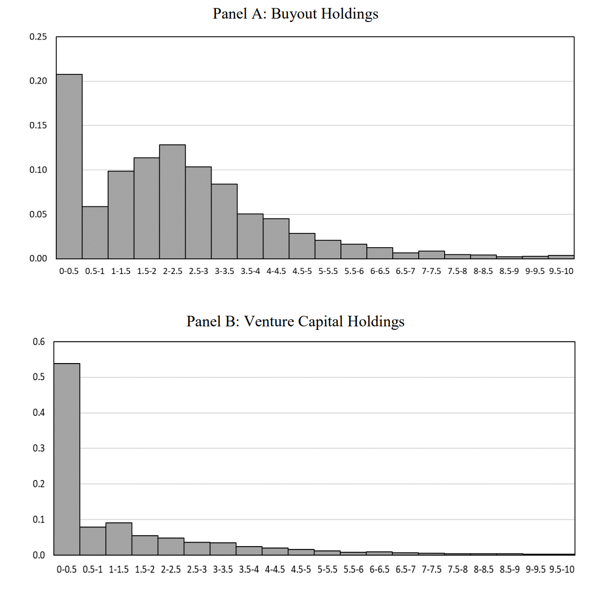
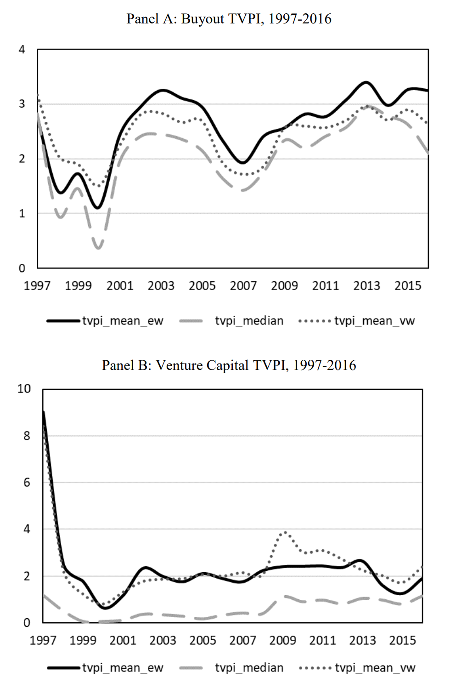
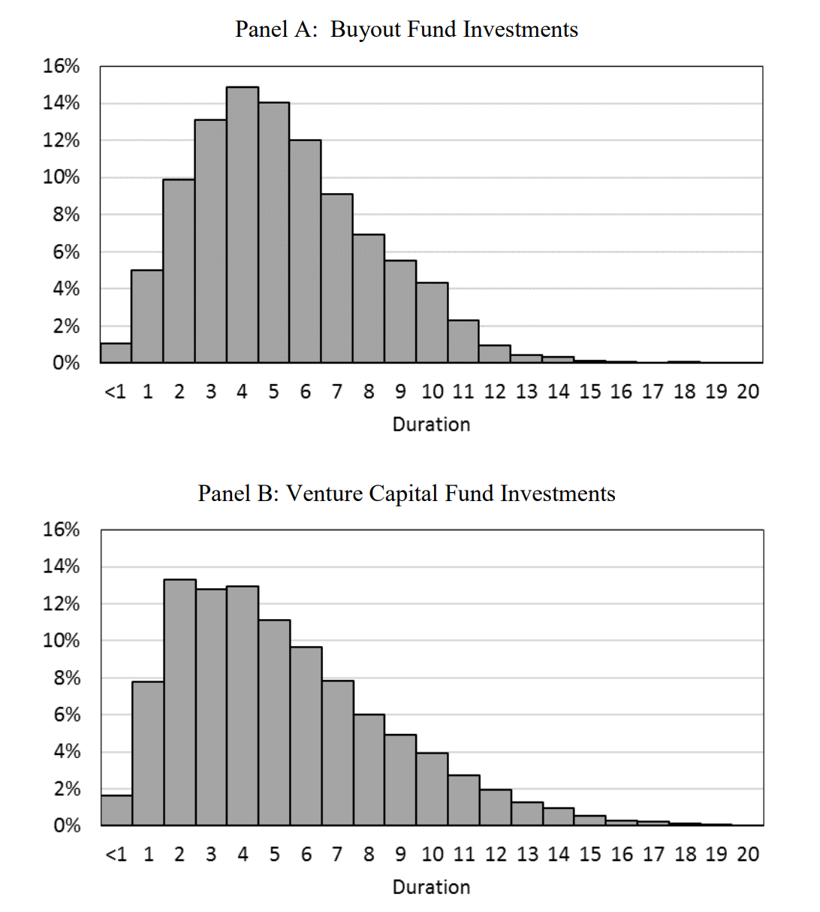
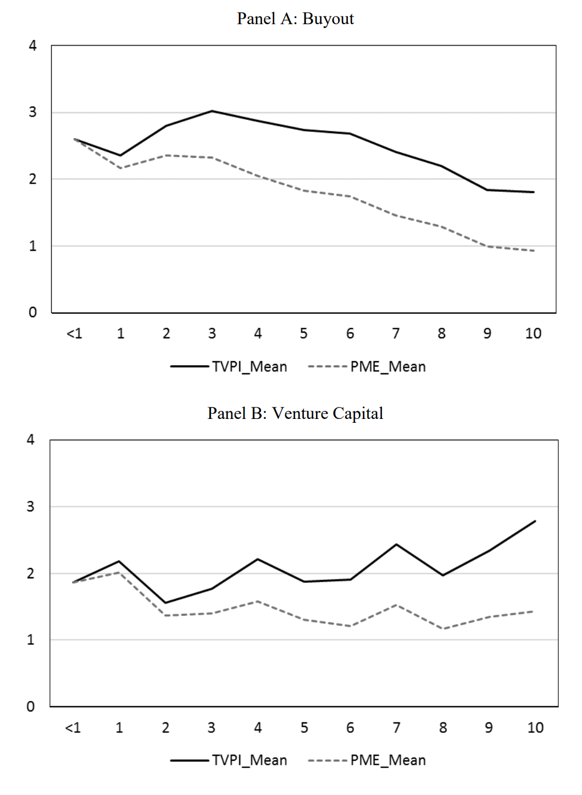

```{r setup, include=FALSE}
knitr::opts_chunk$set(echo = FALSE)
```

I came across a neat [working paper](https://papers.ssrn.com/sol3/papers.cfm?abstract_id=3532444) by @brown-etal:2020. One key issue in private equity ("PE") research is the lack of high-quality data, in particular on underlying portfolio investments. The authors of the paper, some of the most prominent names in the field, are fortunate to get their hands on a large data set of over 45,000 investments in VC and buyout funds. Burgiss can be considered as the gold standard of PE data as they source the data directly from LPs and GPs that use it for their reporting and book-keeping - hence, it comes with very high quality. As I have outlined in [another post](https://www.christoph-jaeckel.com/posts/2021-04-24-the-performance-of-private-equity/), such high-quality data is hard to come by, so it's exciting to see when researchers get their hands on it.

It seems the authors of the paper were just as excited about this: instead of coming up with novel hypotheses and running fancy econometric models, they just provide some summary statistics. I appreciate that. Sometimes a simple table or graph is more insightful than a regression with 10 explanatory factors.

<aside>
Given the authors’ background though, I’m sure they are working hard to squeeze some novel findings out of the data and I look forward to those studies, too.
</aside>

# Distribution of multiples

This will be a short post. The paper is short to start with, so I recommend just reading it, but I will pick those findings that I found most interesting. Let’s get started by looking at the distribution of multiples of realized investments in the sample, shown below. The graph illustrates nicely why VC funds are much riskier than buyout funds, despite more underlying investments per fund: roughly every second VC fund is a full write-off and many more do only marginally better. How do strong VC funds create their performance? By investments that don’t even show up on this chart (as it is cut at 10x). Have a read of [this article](https://www.cbinsights.com/research/best-venture-capital-investments/) about investments that made 40x (Xiaomi), 80x (Zynga), and even 300x (Google) for their investors.



Such returns are simply not possible in a traditional buyout deal with more established companies and larger investment amounts to start with.^[In Table A.1 of the paper, you can see that the mean/median size for buyout investments in the sample is 10.8x/7.5x larger than for VC investments.] However, investors get their money back much more consistently. “Only” every fifth investment is a full write-off and roughly 75% of all investments return more than the invested capital. The mean / median multiple is 2.28x / 2.07x for buyout investments, so on average the invested capital is more than doubled.

Not surprisingly, returns are very cyclical, as shown below. Buyout investments done in the 2010s have seen multiples on average above 3x. In contrast, pre-GFC investments in 2007 only returned 2x, while investments in the 90s did even worse. 



# Does size matter?

The paper goes on to show that there is a negative relation between the size of an investment and its multiple. The 25% largest buyout investments within a year have a value-weighted multiple that is c. 0.7x lower than the 25% smallest buyout investments (see their Figure 3, Panel A). I find this quite interesting as I have found in my [blog post](https://www.christoph-jaeckel.com/posts/2021-04-24-the-performance-of-private-equity/) about PE *fund* performance that the weighted mean multiple of buyout funds is comparable, if not higher, than the mean / median, which implies that large buyout funds perform just as well as the smaller ones (see my Tables 4 and 6).

<aside>
In their Figure A.2, they compare fund vs. holdings performance, so the data set includes both views. Hence, they could look into this topic in more detail. It might simply be the result of different data sources.
</aside>

For VC investments, the authors find that the link between size and performance is positive. Their explanation is that investments in one holding are the sum across all of a fund’s exposure to a portfolio company. Obviously, VC funds are more likely to double down on investments that go well. Note that the effect is much smaller though compared to buyout.

# How long is the holding period?

Just like me, the authors are surprised to find that the median duration for both buyout and VC investments is five years. The surprise stems from the fact that the duration of VC funds is much longer than for buyout funds. A reconciliation of this finding can be found when we look at the relationship between performance and duration further below.



# Is performance related to duration?

Similar to investment size, the results are opposite for buyout and VC investments:

- **Buyout:** The most successful buyout investments are exited relatively early, as can be seen in the graph below. The mean TVPI is the highest for investments exited after 3 years, while it continuously declines thereafter.
- **VC:** The opposite is true for VC investments: the longer an investment is held, the higher the multiple. 



To summarize: the average duration of VC and buyout investments is essentially the same. However, buyout funds exit their best investments relatively early and the multiples go down after a three year holding period. VC funds, on the other hand, generate the highest multiples with investments they were holding for a longer time and in which they invested in several financing rounds. This explains why the DPI on the *fund level* increases so much faster for buyout than for VC funds (see Figure 7 in my performance post).

This concludes my post about this working paper. As mentioned, do yourself a favour and download the paper, it is quite short. You will be rewarded with a few more insights that I did not cover here. For example, they have a detailed descriptive statistics table (Table A.2) that neatly summarizes their data set.
